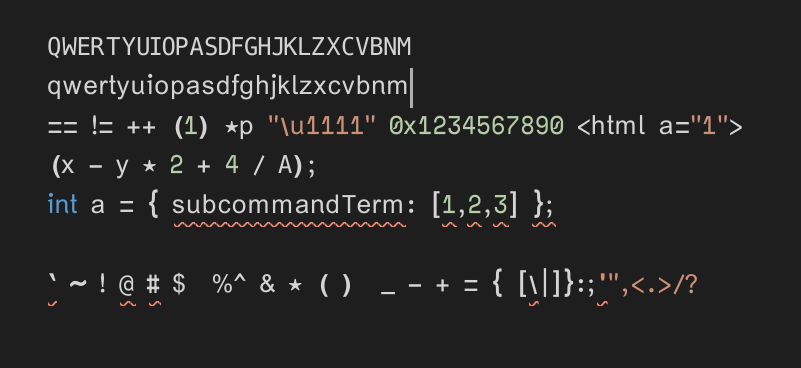
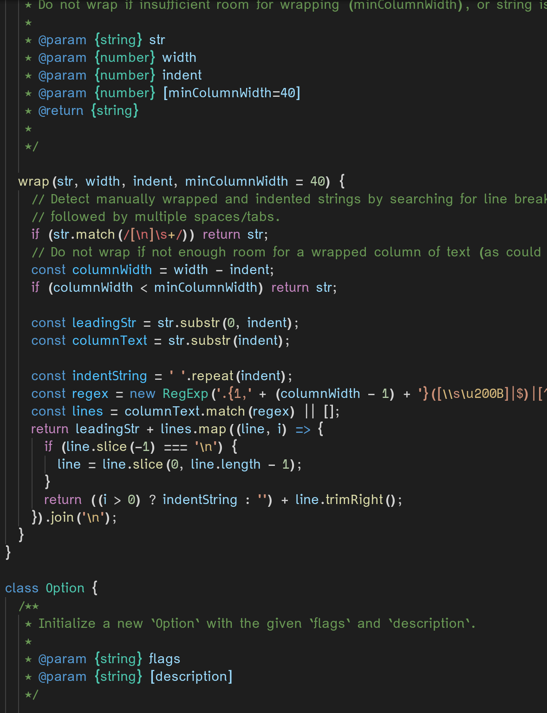
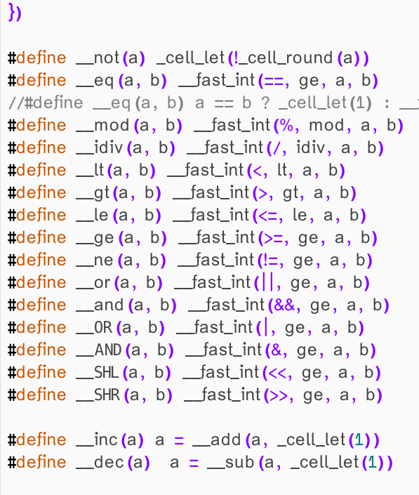
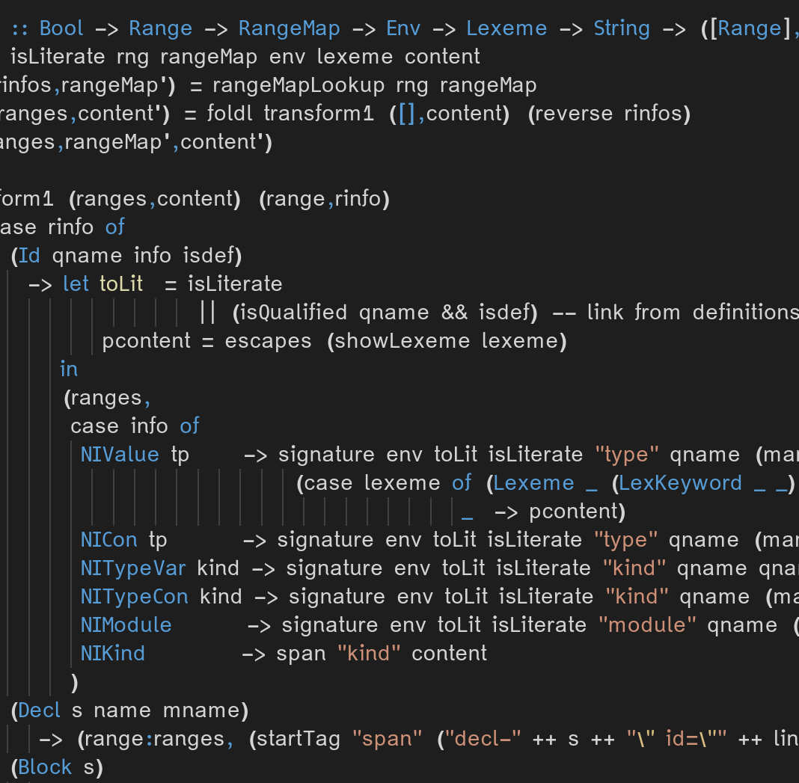
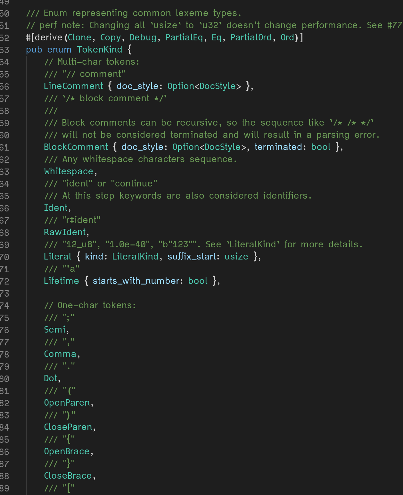

# variable
Variable width font for coding

Carefully designed for coding in IDEs and notepads. Variable width makes text and long identifiers read beautifully while retaining clear look and spacing of each character especially numbers, operators and punctuation marks.

Please pull request your screenshots with this font in your favorite IDE, theme and programming language! I will add everyone to this page.

# samples

> VS Code Plain Text

> VS Code JavaScript

> Geany, C

> VS Code, Haskell

> VS Code, Rust

